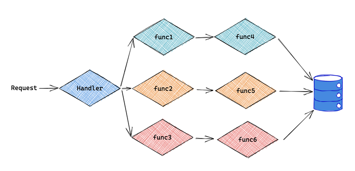

# [一文搞懂如何实现 Go 超时控制](https://segmentfault.com/a/1190000039731121)

## 为什么需要超时控制？

- 请求时间过长，用户侧可能已经离开本页面了，服务端还在消耗资源处理，得到的结果没有意义
- 过长时间的服务端处理会占用过多资源，导致并发能力下降，甚至出现不可用事故

## Go 超时控制必要性

Go 正常都是用来写后端服务的，一般一个请求是由多个串行或并行的子任务来完成的，每个子任务可能是另外的内部请求，那么当这个请求超时的时候，我们就需要快速返回，释放占用的资源，比如goroutine，文件描述符等。



### 服务端常见的超时控制

- 进程内的逻辑处理
- 读写客户端请求，比如HTTP或者RPC请求
- 调用其它服务端请求，包括调用RPC或者访问DB等

## 没有超时控制会怎样？

为了简化本文，我们以一个请求函数 `hardWork` 为例，用来做啥的不重要，顾名思义，可能处理起来比较慢。

```go
func hardWork(job interface{}) error {
    time.Sleep(time.Minute)
    return nil
}

func requestWork(ctx context.Context, job interface{}) error {
  return hardWork(job)
}
```

这时客户端看到的就一直是大家熟悉的画面

绝大部分用户都不会看一分钟菊花，早早弃你而去，空留了整个调用链路上一堆资源的占用，本文不究其它细节，只聚焦超时实现。

下面我们看看该怎么来实现超时，其中会有哪些坑。

## 第一版实现

大家可以先不往下看，自己试着想想该怎么实现这个函数的超时，第一次尝试：

```go
func requestWork(ctx context.Context, job interface{}) error {
    ctx, cancel := context.WithTimeout(ctx, time.Second*2)
    defer cancel()

    done := make(chan error)
    go func() {
        done <- hardWork(job)
    }()

    select {
    case err := <-done:
        return err
    case <-ctx.Done():
        return ctx.Err()
    }
}
```

我们写个 main 函数测试一下

```go
func main() {
    const total = 1000
    var wg sync.WaitGroup
    wg.Add(total)
    now := time.Now()
    for i := 0; i < total; i++ {
        go func() {
            defer wg.Done()
            requestWork(context.Background(), "any")
        }()
    }
    wg.Wait()
    fmt.Println("elapsed:", time.Since(now))
}
```

跑一下试试效果

```shell
➜ go run timeout.go
elapsed: 2.005725931s
```

超时已经生效。但这样就搞定了吗？

## goroutine 泄露

让我们在main函数末尾加一行代码看看执行完有多少goroutine

```go
time.Sleep(time.Minute*2)
fmt.Println("number of goroutines:", runtime.NumGoroutine())
```

sleep 2分钟是为了等待所有任务结束，然后我们打印一下当前goroutine数量。让我们执行一下看看结果

```shell
➜ go run timeout.go
elapsed: 2.005725931s
number of goroutines: 1001
```

goroutine泄露了，让我们看看为啥会这样呢？首先，`requestWork` 函数在2秒钟超时后就退出了，一旦 `requestWork` 函数退出，那么 `done channel` 就没有goroutine接收了，等到执行 `done <- hardWork(job)` 这行代码的时候就会一直卡着写不进去，导致每个超时的请求都会一直占用掉一个goroutine，这是一个很大的bug，等到资源耗尽的时候整个服务就失去响应了。

那么怎么fix呢？其实也很简单，只要 `make chan` 的时候把 `buffer size` 设为1，如下：

```go
done := make(chan error, 1)
```

这样就可以让 `done <- hardWork(job)` 不管在是否超时都能写入而不卡住goroutine。此时可能有人会问如果这时写入一个已经没goroutine接收的channel会不会有问题，在Go里面channel不像我们常见的文件描述符一样，不是必须关闭的，只是个对象而已，`close(channel)` 只是用来告诉接收者没有东西要写了，没有其它用途。

改完这一行代码我们再测试一遍：

```shell
➜ go run timeout.go
elapsed: 2.005655146s
number of goroutines: 1
```

goroutine泄露问题解决了！

## panic 无法捕获

让我们把 `hardWork` 函数实现改成

```go
panic("oops")
```

修改 `main` 函数加上捕获异常的代码如下：

```go
go func() {
  defer func() {
    if p := recover(); p != nil {
      fmt.Println("oops, panic")
    }
  }()

  defer wg.Done()
  requestWork(context.Background(), "any")
}()
```

此时执行一下就会发现panic是无法被捕获的，原因是因为在 `requestWork` 内部起的goroutine里产生的panic其它goroutine无法捕获。

解决方法是在 `requestWork` 里加上 `panicChan` 来处理，同样，需要 `panicChan` 的 `buffer size` 为1，如下：

```go
func requestWork(ctx context.Context, job interface{}) error {
    ctx, cancel := context.WithTimeout(ctx, time.Second*2)
    defer cancel()

    done := make(chan error, 1)
    panicChan := make(chan interface{}, 1)
    go func() {
        defer func() {
            if p := recover(); p != nil {
                panicChan <- p
            }
        }()

        done <- hardWork(job)
    }()

    select {
    case err := <-done:
        return err
    case p := <-panicChan:
        panic(p)
    case <-ctx.Done():
        return ctx.Err()
    }
}
```

改完就可以在 `requestWork` 的调用方处理 `panic` 了。

## 超时时长一定对吗？

上面的 `requestWork` 实现忽略了传入的 `ctx` 参数，如果 `ctx` 已有超时设置，我们一定要关注此传入的超时是不是小于这里给的2秒，如果小于，就需要用传入的超时，`go-zero/core/contextx` 已经提供了方法帮我们一行代码搞定，只需修改如下：

```go
ctx, cancel := contextx.ShrinkDeadline(ctx, time.Second*2)
```

## Data race

这里 `requestWork` 只是返回了一个 `error` 参数，如果需要返回多个参数，那么我们就需要注意 `data race`，此时可以通过锁来解决，具体实现参考 `go-zero/zrpc/internal/serverinterceptors/timeoutinterceptor.go`，这里不做赘述。

## 完整示例

```go
package main

import (
    "context"
    "fmt"
    "runtime"
    "sync"
    "time"

    "github.com/tal-tech/go-zero/core/contextx"
)

func hardWork(job interface{}) error {
    time.Sleep(time.Second * 10)
    return nil
}

func requestWork(ctx context.Context, job interface{}) error {
    ctx, cancel := contextx.ShrinkDeadline(ctx, time.Second*2)
    defer cancel()

    done := make(chan error, 1)
    panicChan := make(chan interface{}, 1)
    go func() {
        defer func() {
            if p := recover(); p != nil {
                panicChan <- p
            }
        }()

        done <- hardWork(job)
    }()

    select {
    case err := <-done:
        return err
    case p := <-panicChan:
        panic(p)
    case <-ctx.Done():
        return ctx.Err()
    }
}

func main() {
    const total = 10
    var wg sync.WaitGroup
    wg.Add(total)
    now := time.Now()
    for i := 0; i < total; i++ {
        go func() {
            defer func() {
                if p := recover(); p != nil {
                    fmt.Println("oops, panic")
                }
            }()

            defer wg.Done()
            requestWork(context.Background(), "any")
        }()
    }
    wg.Wait()
    fmt.Println("elapsed:", time.Since(now))
    time.Sleep(time.Second * 20)
    fmt.Println("number of goroutines:", runtime.NumGoroutine())
}
```

## 更多细节

请参考 `go-zero` 源码：

- `go-zero/core/fx/timeout.go`
- `go-zero/zrpc/internal/clientinterceptors/timeoutinterceptor.go`
- `go-zero/zrpc/internal/serverinterceptors/timeoutinterceptor.go`

## 项目地址

[https://github.com/tal-tech/go-zero](https://link.segmentfault.com/?enc=FSc%2BZhryY%2FGm1SFBceB7Kw%3D%3D.7S5Tn0va5KIFCGd%2BCuagXS%2BQenNszuHJONTYg1gvYOQWGxgS7RZnghCEoE%2FPYlaV)

欢迎使用 `go-zero` 并 **star** 支持我们！

## 微信交流

关注『微服务实践』公众号并回复 进群 获取社区群二维码。

> go-zero 系列文章见『微服务实践』公众号